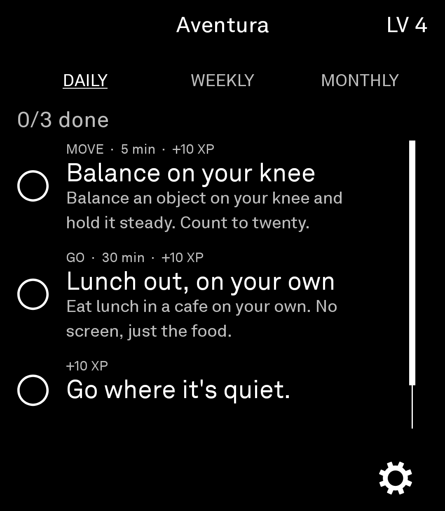
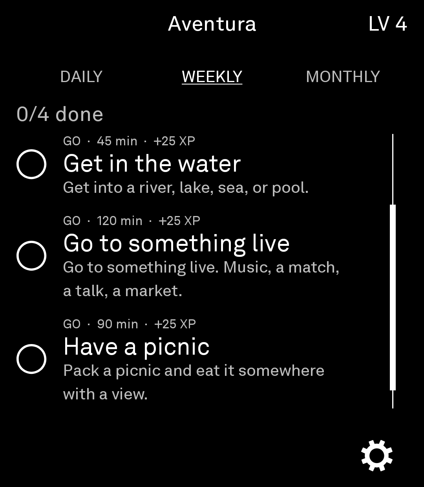
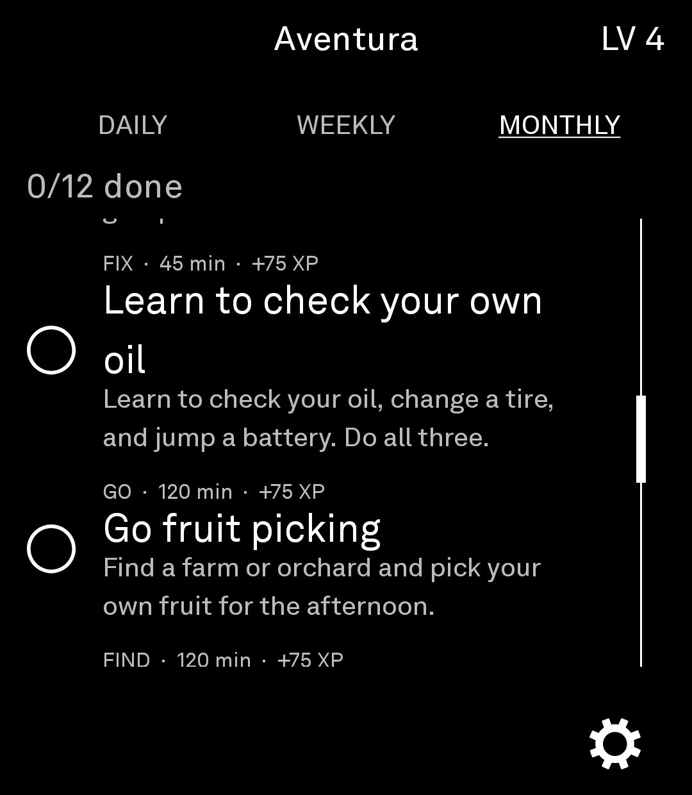
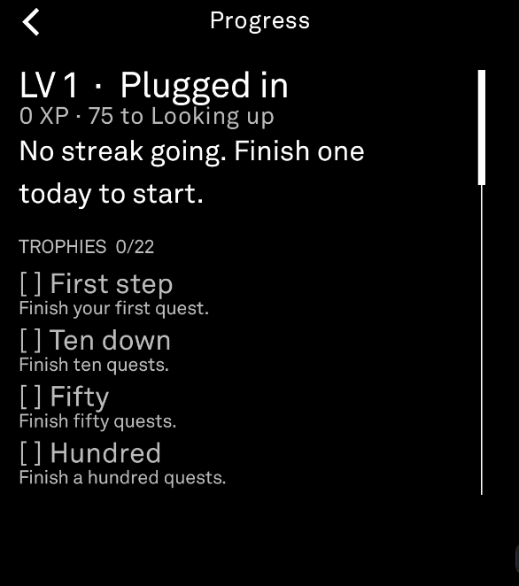

# Aventura

A quest app for the Light Phone III. Every day, week, and month it gives you a short list of things to go do, like finding a flower nobody planted, talking to a stranger, or planning a day trip. Check them off, level up, and build a streak. No overlays, no nagging notifications, no algorithm.

The app code lives in [`aventura/`](./aventura) (see [`aventura/README.md`](./aventura/README.md)).

## Features

- **Daily, weekly, and monthly quests**: 3 a day, 4 a week, and 12 a month, drawn from a pool of over 300. Each set is picked from the date, stays the same for the whole period, and rotates when the period ends. No management needed.
- **XP and levels**: finishing a quest earns XP. Daily quests are worth the least and monthly quests the most. Fifteen levels, from "Plugged in" to "Offline Success."
- **Streaks**: finish at least one quest a day to keep your streak climbing. Long streaks earn bonus XP on top of the normal reward.
- **Trophies**: 22 in total, for things like finishing your first quest, clearing every quest in a day, or keeping a streak alive for a month.
- **Progress screen**: your level, your streak, every trophy earned and unearned, and a full history of completed quests.
- **Settings**: switch to a light theme, turn streaks or trophies off to keep only the quests, back up your data (inside the app and as dated files in Documents/Aventura, plus an automatic daily backup) and restore it later, or reset everything.

## Screenshots

<table>
<tr>
<td><br><sub>Daily</sub></td>
<td><br><sub>Weekly</sub></td>
</tr>
<tr>
<td><br><sub>Monthly</sub></td>
<td><br><sub>Progress</sub></td>
</tr>
</table>

## Installation

### From Releases

Download the latest APK from [Releases](https://github.com/tyshi00/Aventura/releases) and install it over ADB:

```
adb install <downloaded-file>.apk
```

### From Source

The Light SDK libraries are hosted on GitHub Packages, so you need a GitHub token with the `read:packages` scope. Add your credentials to `local.properties` in the project root:

```
gpr.user=YOUR_GITHUB_USERNAME
gpr.key=YOUR_GITHUB_TOKEN
```

Then build:

```
./gradlew :aventura:assembleRelease
```

### Restoring after a reinstall

Each backup is also saved as a dated file in `Documents/Aventura`, and Aventura saves one about once a day when you open it. Those files survive an uninstall. Android will not let a reinstalled app open them, so one copy has to be made by hand over ADB:

```
adb pull /sdcard/Documents/Aventura
adb push <path-to-backup-file> /sdcard/Android/media/com.tyshi00.aventura/
```

Replace `<path-to-backup-file>` with the full path to the pulled backup on your computer. Backup names start with `aventura-manual` or `aventura-auto`. For example:

```
adb push C:\Users\you\AventuraBackups\aventura-manual-2026-10-06-195633.json /sdcard/Android/media/com.tyshi00.aventura/
```

Then open Aventura, go to Settings, then Backup & restore, and tap Restore from folder. The same steps are shown on that screen.

## Credits

Built on the [Light SDK](https://github.com/lightphone/light-sdk) by The Light Phone (MIT). The original copyright notice is kept in [LICENSE](LICENSE), and the SDK's own README is kept in [README.light-sdk.md](README.light-sdk.md).

Aventura is a Light Phone port of [Soto](https://codeberg.org/potentialuselessness/Soto/src/branch/main), an Android app that shows a full-screen quest prompt whenever your phone loses its internet connection. Credit for the idea, the quest writing, and the XP and trophy design goes to Soto, and its quest pool is the foundation of this app. Used with permission from the Soto author.

The Light Phone III doesn't let apps watch for a lost connection or take over the screen, so Aventura waits in your tools list instead, since the Light Phone is already the disconnected device. Extra monthly quests were added to Soto's pool because the original monthly list repeated sooner than the daily and weekly ones.

## License

MIT. See [LICENSE](LICENSE).

## Disclaimer

Unofficial, independent open-source project — not affiliated with or endorsed by The Light Phone, Inc. Light Phone and Light OS are trademarks of The Light Phone, Inc.
