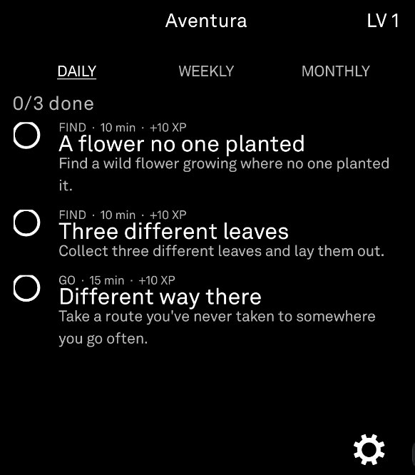
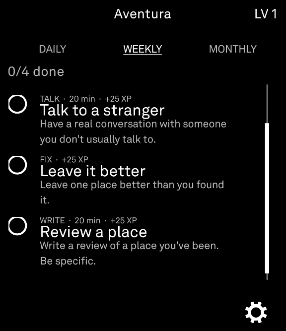
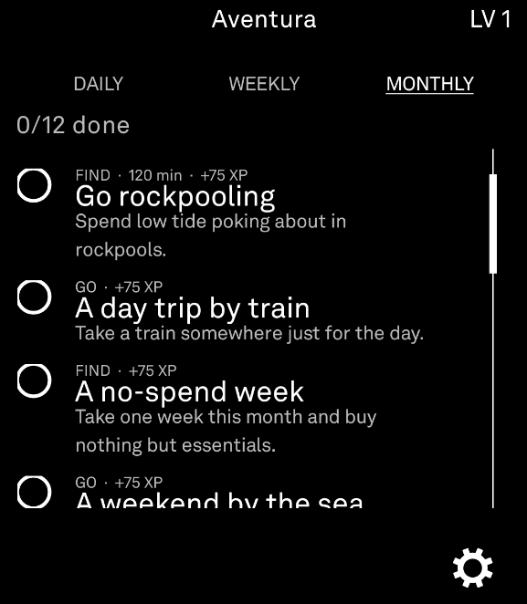
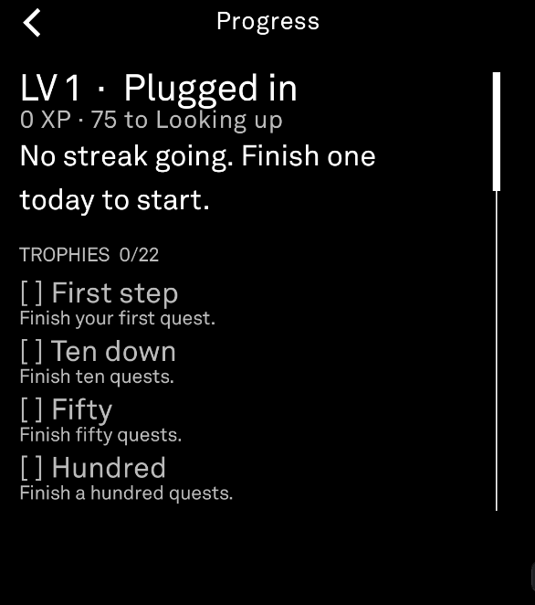

# Aventura

A little quest app for the Light Phone III. Every day, week, and month it hands you a short list of things to actually go do, things like finding a flower nobody planted, talking to a stranger, or planning a day trip somewhere new. Check them off as you finish them, watch your level go up, and build a streak.

No overlays, no notifications nagging you, no algorithm. You open it, you see what's on the list, you go do the thing.

## What it does

- **Daily, weekly, and monthly quests.** 3 a day, 4 a week, 12 a month, pulled from a pool of over 300. The set is picked automatically based on the date so it stays the same all day (or week, or month) and then rotates to a fresh batch when the period ends. Nobody has to manage this, it just works in the background.
- **XP and levels.** Finishing a quest earns XP, daily quests are worth the least and monthly quests the most. Twelve levels total, starting at "Plugged in" and ending at "Reconnected."
- **Streaks.** Finish at least one quest a day and your streak keeps climbing. Keep it going long enough and you start earning bonus XP on top of the normal reward.
- **Trophies.** 22 of them, for things like finishing your first quest, clearing every quest in a single day, or keeping a streak alive for a month straight.
- **Progress screen.** Your level, your streak, every trophy you've earned (and haven't), and a full history of everything you've completed.
- **Settings.** Flip to a light theme if that's more your thing, or wipe your data and start over.

## Screenshots

<table>
<tr>
<td> Daily</td>
<td> Weekly</td>
</tr>
<tr>
<td> Monthly</td>
<td> Progress</td>
</tr>
</table>

## Credit where it's due

Aventura is a Light Phone port of [Soto](https://github.com/), an Android app that raises a full screen quest prompt whenever your phone loses its connection to the internet. All the credit for the actual idea, the quest writing, and the XP and trophy design goes to Soto. Its quest pool is the foundation this whole app is built on.

The Light Phone III doesn't allow apps to watch for a lost connection or take over the screen the way Soto does on Android, so Aventura works a little differently. Instead of popping up when you go offline, it's just sitting there in your tools list waiting for you to open it, since the Light Phone is already the disconnected device. A batch of extra month-long quests was also added on top of Soto's original pool, since the monthly list was small enough that it started repeating sooner than the daily and weekly ones did.

## Using it

Install the APK on your Light Phone III.
